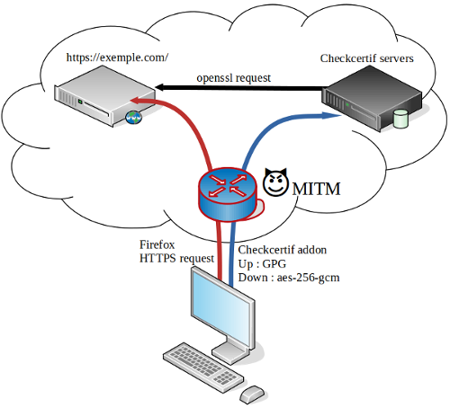

Work in progress !  

# checkcertif
  
The purpose of this project is to detect a Man In The Middle (MITM) attack.  
  
  
  
The project is split in 2 parts.  
- [a firefox's addon](https://github.com/Oros42/checkcertif_addon)
- [a server](https://github.com/Oros42/checkcertif_server)
  
## Demo
[Development demo](https://chkcrt-dev.ecirtam.net/)
  
## Tests
[Run tests](./tests/README.md)
