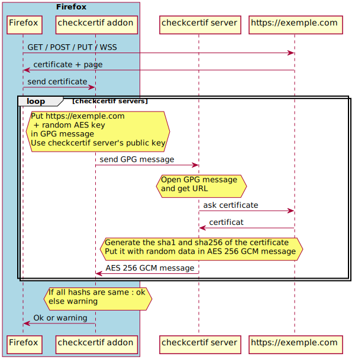

Work in progress !  

# checkcertif
  
The purpose of this project is to detect a Man In The Middle (MITM) attack.  
The project is split in 2 parts.  
- [a firefox's addon](https://github.com/Oros42/checkcertif_addon)
- [a server](https://github.com/Oros42/checkcertif_server)
    
  
  
  

## Demo
[Development demo](https://chkcrt-dev.ecirtam.net/)
  
## Tests
[Run tests](./tests/README.md)

## TODO
### addon
- catch error and display message
- CSS
- ergonomics
- detection of CDN
- i18n
- white list and black list of URL to check
- fix no response « … » (wait)
- posibility to change the domains.js

### server
- simplify the install
- new repo for optionnal install with docker